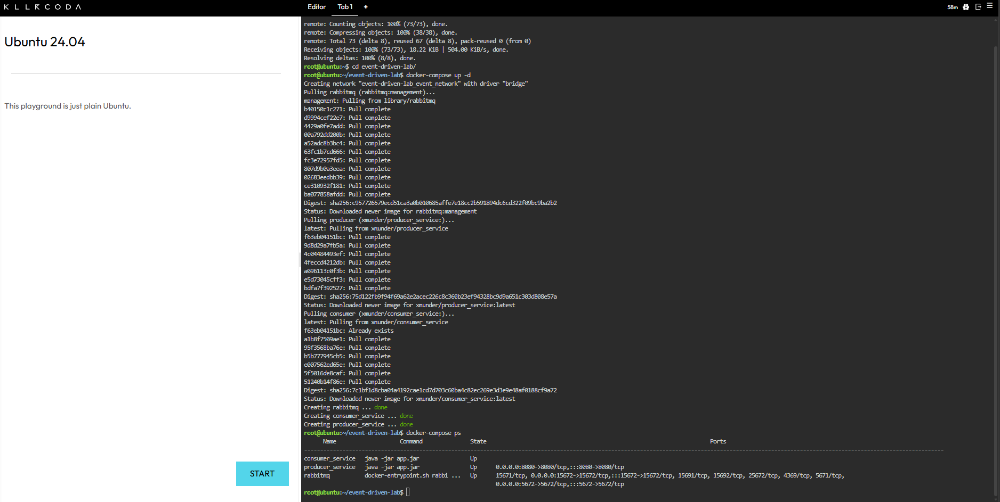
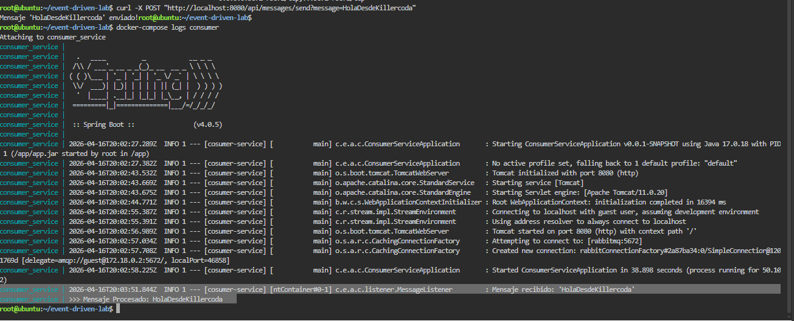
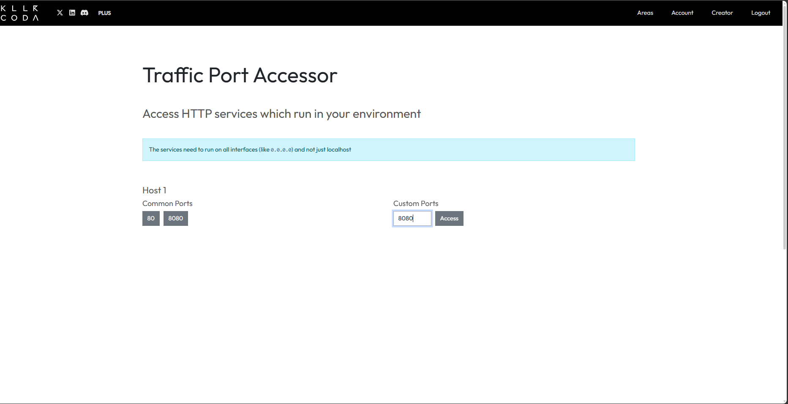
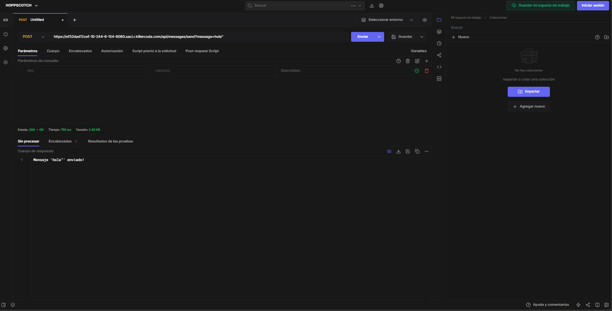
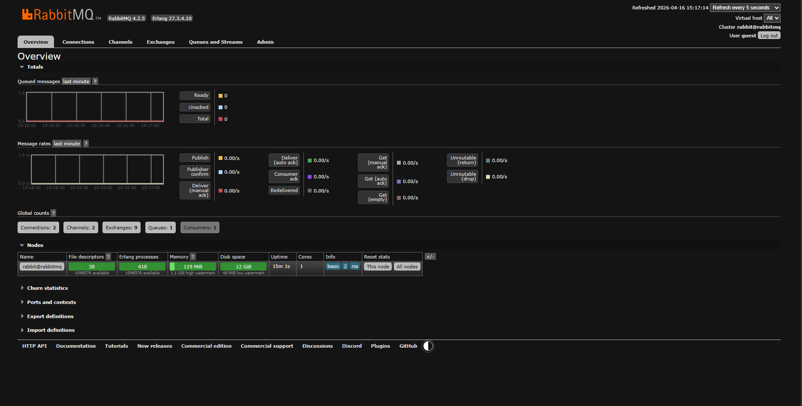
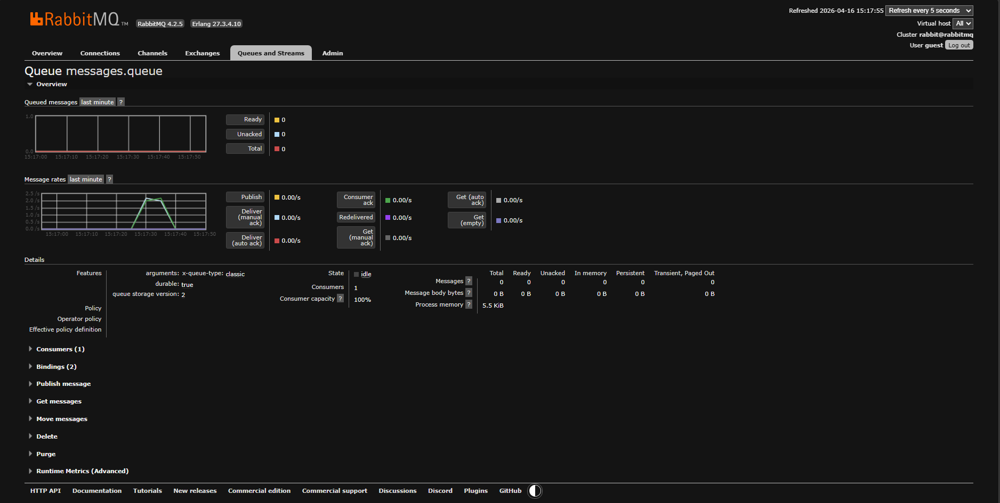

# event-driven-lab

## Intregantes
- Cristian Camilo Gómez Fernández

## Descripción
Este laboratorio muestra cómo crear un sistema de microservicios con Spring Boot y RabbitMQ, usando Docker Compose para orquestar los servicios.

## Qué se hizo
1. Se creó el servicio **producer-service** con Spring Boot.
   - Se configuró un endpoint REST `/api/messages/send` para enviar mensajes.
   - Se añadió la configuración de RabbitMQ con exchange, cola y binding.
   - Se creó un `Dockerfile` para empaquetar el servicio.

2. Se creó el servicio **consumer-service** con Spring Boot.
   - Se configuró la cola de RabbitMQ para que exista aunque el consumidor arranque primero.
   - Se agregó un listener con `@RabbitListener` para procesar mensajes de la cola.
   - Se creó un `Dockerfile` para empaquetar el servicio.

3. Se definió el archivo `docker-compose.yml`.
   - Se incluyó RabbitMQ con la imagen `rabbitmq:management`.
   - Se configuraron los servicios `producer` y `consumer` para que usaran RabbitMQ por nombre de servicio.

4. Se realizó el empaquetado de los proyectos con Maven (`mvn package`).

5. Se construyeron las imágenes Docker para los dos microservicios.

6. Se probó el flujo usando **Killercoda**.
   - Se levantó el stack con `docker compose up -d`.
   - Se envió un mensaje al productor con `curl -X POST "http://localhost:8080/api/messages/send?message=HolaDesdeKillercoda"`.
   - Se verificó que el consumidor recibiera y procesara el mensaje.

## Evidencias
Las imágenes de evidencia están en la carpeta `evidences` y están numeradas del 1 al 5:

## Resultado final
El laboratorio demuestra cómo conectar un productor y un consumidor usando RabbitMQ, y cómo desplegarlo todo fácilmente con Docker Compose en un entorno de pruebas.
